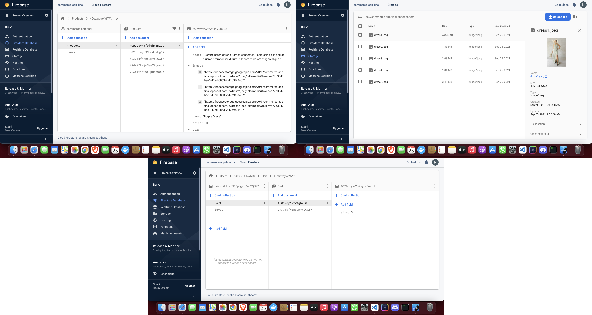

# Apparel E Commerce App

Developement Stack 

## Getting Started

This project is a starting point for a Flutter application.

A few resources to get you started if this is your first Flutter project:

- [Lab: Write your first Flutter app](https://flutter.dev/docs/get-started/codelab)
- [Cookbook: Useful Flutter samples](https://flutter.dev/docs/cookbook)

For help getting started with Flutter, view our
[online documentation](https://flutter.dev/docs), which offers tutorials,
samples, guidance on mobile development, and a full API reference.

1. Clone the repository `https://github.com/nakshatrasinghh/Apparel-E-Commerce-App.git`
2. Run `flutter pub get` in terminal
3. Add `google-servies.json / google-servies.plist` file from firebase application setup
4. Create firestore database schema as shown below.
5. Run `main.dart` and feel the power ⚡️

# Demo

</img>

# Firebase

  

